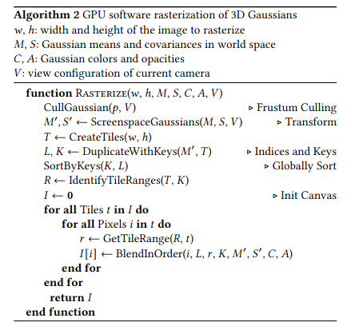

# cuSplat

### Hardware-accelerated 3D Gaussian Splatting pipeline using CUDA.
 
Optimized on a 3050Ti laptop.

## 3DGS Architecture

The architecture of this project has been made with respect to the [original 3DGS paper](https://repo-sam.inria.fr/fungraph/3d-gaussian-splatting/3d_gaussian_splatting_high.pdf) 
which describes the high level design within the `rasterize()` algorithm defined as : 


## Branches

- `main` : The primary branch containing the latest stable GPU code, incorporating all optimizations documented in the project reports.
- `cpu-baseline` : First implementation of 3DGS in pure C++ (CPU) following the original Inria paper architecture.
- `gpu-baseline` : GPU implementation of 3DGS, porting the CPU pipeline in CUDA with no optimization yet.
- `gpu-opti-1` : Optimization of the gpu-baseline, include every optimization found in the report of its branch (including memory
transfer optimizations, profiling & optimization of the alphaBlend kernel)
- `gpu-opti-x` : Incremental optimization branches (where x is a number). Higher numbers include all improvements from 
previous branches plus new optimizations detailed in that branch's report (e.g., gpu-opti-2 builds directly on top of gpu-opti-1).

## Usage

To compile the project you should at least have installed cmake and nvidia developper toolkit.

You should compile at the root of the repo : \
Build the project \
```$> cmake -B build``` \
Compile it \
```$> cmake --build build``` \
\
In the build file you have 2 binary you can execute :
- `snapshot` : execute the pipeline on a single frame. Used to have a quick preview of the output.
- `bench` : Benchmarks the entire pipeline using CUDA events to collect accurate GPU timing metrics. The test runs first on a single frame, then across 200 consecutive frames from the same camera perspective.