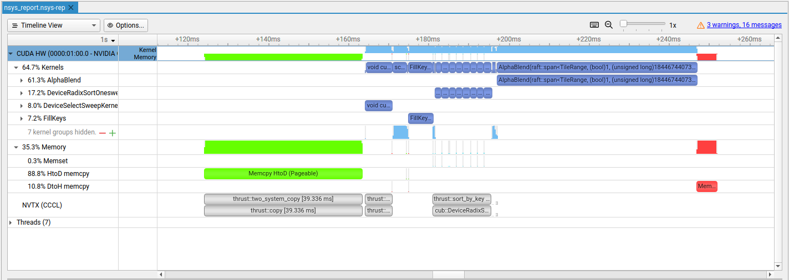

# Optimization report

Here is a clear view of the performance of cuSplat for the gpu baseline branch, before any optimization.

*NSight System screenshot for the GPU baseline with no optimization (`nsys_report.nsys-rep`)*

At first glance, there are two main concerning parts. First the memory transfert from host to device that comes
from `thrust::copy` so it relate to the first transfert of every gaussian to the GPU. The second part, and the one taking
most the time, is the alpha blending kernel.

## Memory transfert

One thing we can note is that from this HtoD transfert, source memory kind is said to be `pageable`. However paged memory
needs to first be copied by the driver to pinned memory which hurt performance. Allocating gaussians host's variable (holding every gaussians of the scene) with `cudaHostAlloc`
allows us to fill its content directly in pinned memory and make the HtoD transfert faster.