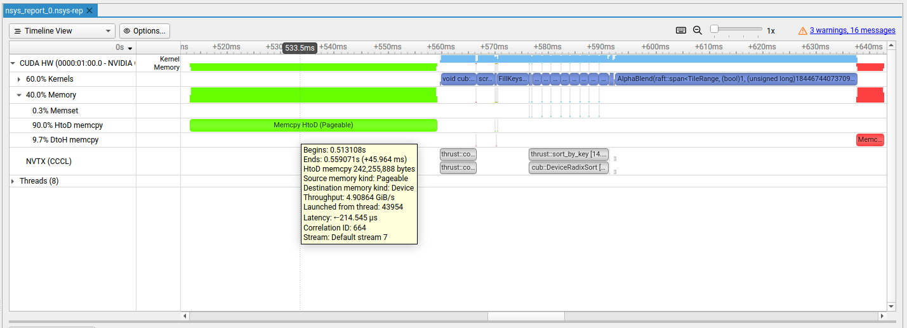
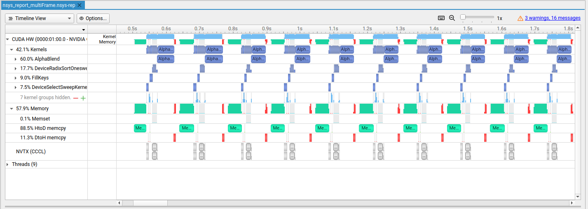
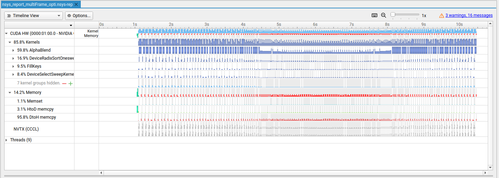
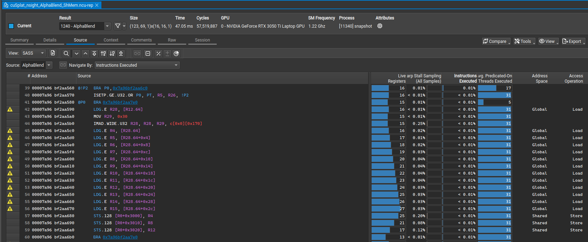

# Optimization report

Here is a clear view of the performance of cuSplat for the gpu baseline branch, before any optimization.

*NSight System screenshot for the GPU baseline with no optimization - 1 frame (`nsys_report.nsys-rep`)*

At first glance, there are two main concerning parts. First the memory transfert from host to device that comes
from `thrust::copy` so it relate to the first transfert of every gaussian to the GPU. The second part, and the one taking
most the time, is the alpha blending kernel.

`1 Frame : 0.137 second` \
`200 Frames : 0.135 second (avg)`

## Memory transfer

### Reducing memory transfer
By generating only one frame, we miss a lot of the memory transfert work that would be done in a realistic use of a 3DGS renderer.
Indeed when we loop on the rasterization process (as it would be done in a real-time renderer), we are going from a workload of 66%
for kernels and 33% for memory to 42% kernel and 58% memory.

*NSight System screenshot for GPU baseline using pinned memory - 200 frames (`nsys_report_multiFrame.nsys-rep`)*

It is explained by the transfers of the raw gaussians that are done at the rasterization step, thus once per frame (even though each frame use the exact same gaussians, as we handle the same scene).
Doing transfer in rasterization did not matter when we were doing it for only one frame, but it became relevant when we handled a lot of them.
That's why, relocating gaussians to the device once and for all before any rasterization will avoid a lot of useless memory workload.

*NSight System screenshot for GPU baseline using pinned memory and loading the gaussians only once - 200 frames (`nsys_report_multiFrame_opti.nsys-rep`)*

It can now be clearly seen that, with a big enough number of frames, most of the remaining optimization is at kernel level with more than 85% of the workload being at kernel execution time.
The reason why the `1 Frame` execution also got sped up is because we took out the transfer process out of rasterization.
The timing being a record of a cuda event only on the rasterization process, gaussians HtoD is not recorded anymore. 
It is still relevant to note this speedup as every process done outside of the rasterization function is ran only once instead
of running it again at each frame.

`1 Frame : 0.0923 second` x1.48 SpeedUp \
`200 Frames : 0.086 second (avg)` x1.57 SpeedUp

> Note : Host memory allocation for `gaussians` and `image` has also changed to `cudaHostAlloc()` to use pinned memory,
> it increased memory throughput (from 4.9GiB/s to 6.3GiB/s) but no significant overall speedup was made (as `gaussians` loading is done once for every frame) so no section has been written about it

## Alpha Blend's Kernel

With memory transfer enhanced, when running 200 frames, more than 85% of the workload is in kernels! More precisely, most
of the workload, almost 60% of it, is done by only one kernel : `AlphaBlend`. \
Looking at it in Nsight Compute, 
the most important issue is L1 memory access patter with an `Est. Speedup: 80.37%` for `L1TEX Global Load Access Pattern` and
an `Est. Speedup: 64.13%` for `L1TEX Global Store Access Pattern` (`cuSplat_nsight_AlphaBlend.ncu-rep`).

### Memory pressure - Load

Looking at the kernel's global load we notice in the alpha blending's for loop that each thread asks for `gaussSplateds[gaussianKeysIdx[gaussian]]`. It is worth noting
that each thread in the same block uses the same `start`-`end` range (which the `gaussian` variable iterate over), meaning they all retrieve the same variable. 
Thus, instead of each thread in a block asking for the same variable in global memory, we could load it only once in shared memory, by a single thread. It will help reduce pressure
on global memory and make accessing faster thanks to the speed of shared memory.

To avoid any stalling thread, we use collaborative loading, such that not only one but each thread of the block load one value in a shared memory array,
processing gaussians of the block (tile) by chunk of block's size. \
To reduce the number of barriers (`__syncthreads()`) in the for loop, a **double buffering** loading has been implemented,
such that each time we need to load new gaussians, we load it in the "oldest" buffer we used. This way, one thread don't 
overwrite value on the shared array that still could be used by another thread still processing its data in previous 
for loop iteration (each thread having its own pace until the one `__syncthreads()`).

`1 Frame : 0.078 second` x1.18 SpeedUp \
`200 Frames : 0.072 second (avg)` x1.19 SpeedUp

With this new version `L1TEX Global Load Access Pattern` Est. Speedup dropped to 64.63% (prev. 80.37%). However, this percentage
is still huge and came with a new one : `Uncoalesced Global Accesses - Est. Speedup: 59.61%`. To understand where this uncoalesced
access comes from, we need to look at the Nsight compute `Source` tab.

*NSight Compute source tab screenshot (`cuSplat_nsight_AlphaBlend_ShMem.ncu-rep`)*

We note that a small part of excessive access (line 42) comes from load of global variable `gaussianKeysIdx`, later used as an index, but only 17.84% of its global access are excessive 
(according to the warning note), the reason for that is because loading process is contiguous, `gaussianKeysIdx[start + tid + offset]` 
with start and offset being the same for each thread, tid values are linear (thread id, 0,1,2,3,...) so our access to `gaussianKeysIdx` is contiguous. \
On the other hand, the 12 loading call for the gaussian load (lines 45-56), have 87.46% of global excessive access.
The reason why this happens, is because even though `gaussianKeysIdx` access is coalesced, it return index that could be anywhere in the gaussian array, thus one thread can hit a very different
part of the `gaussSplateds` list, loading useless bytes surrounding the one needed value, which other threads do not necessarily need.

