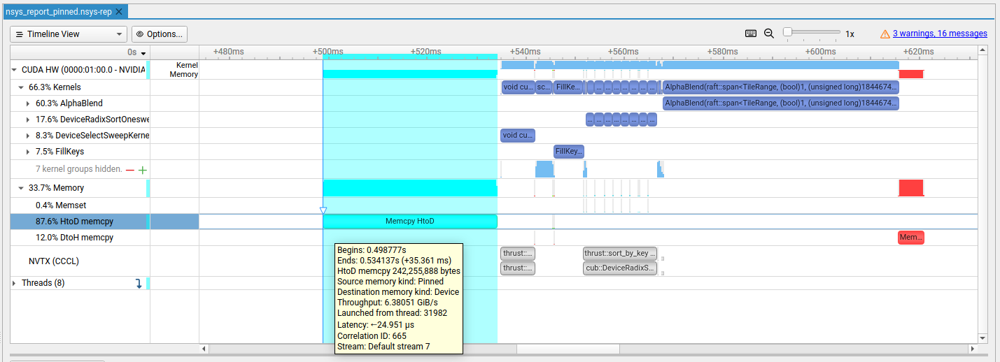

# Optimization report

Here is a clear view of the performance of cuSplat for the gpu baseline branch, before any optimization.

*NSight System screenshot for the GPU baseline with no optimization - 1 frame (`nsys_report.nsys-rep`)*

At first glance, there are two main concerning parts. First the memory transfert from host to device that comes
from `thrust::copy` so it relate to the first transfert of every gaussian to the GPU. The second part, and the one taking
most the time, is the alpha blending kernel.

## Memory transfer

### Pinned Memory
One thing we can note is that from this HtoD transfert, source memory kind is said to be `pageable`. However paged memory
needs to first be copied by the driver to pinned memory which hurt performance. Allocating gaussians host's variable (holding every gaussians of the scene) with `cudaHostAlloc`
allows us to fill its content directly in pinned memory and make the HtoD transfert faster.

*NSight System screenshot for GPU baseline using pinned memory - 1 frame (`nsys_report_pinned.nsys-rep`)*

However, there's no significant speedup going from `45.964 ms` using pageable memory against `35.361 ms` with pinned memory.
Even though we avoid a potential copy by the driver, most of the work (i.e. Host to Device transfer) still need to be done.

### Reducing memory transfer
By generating only one frame, we miss a lot of the memory transfert work that would be done in a realistic use of a 3DGS renderer.
Indeed when we loop on the rasterization process (as it would be done in a real-time renderer), we are going from a workload of 66% 
for kernels and 33% for memory to 42% kernel and 58% memory.

*NSight System screenshot for GPU baseline using pinned memory - 200 frames (`nsys_report_multiFrame.nsys-rep`)*

It is explained by the transfers of the raw gaussians that are done at the rasterization step, thus once per frame (even though each frame use the exact same gaussians, as we handle the same scene).
Doing transfer in rasterization did not matter when we were doing it for only one frame, but it became relevant when we handled a lot of them.
That's why, relocating gaussians to the device once and for all before any rasterization will avoid a lot of useless memory workload.

*NSight System screenshot for GPU baseline using pinned memory and loading the gaussians only once - 200 frames (`nsys_report_multiFrame_opti.nsys-rep`)*

It can now be clearly seen that most of the remaining optimization is at kernel level with more than 85% of the workload being at kernel execution time.
